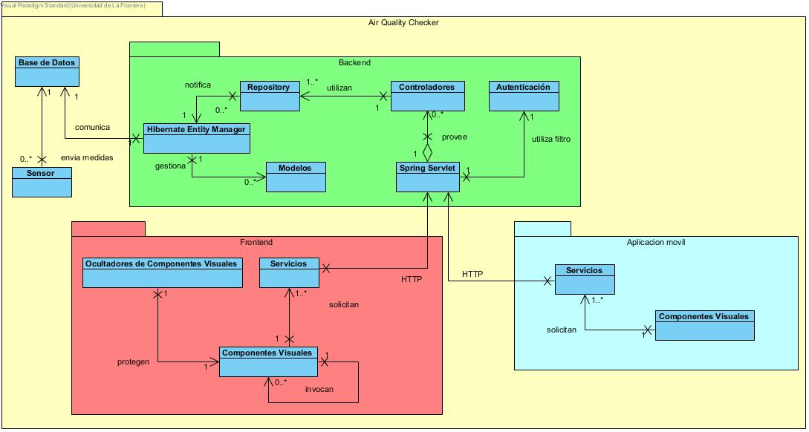

Estructura 
==================================

Visión de Conjunto
------------------

El sistema se encuentra compuesto por tres componentes principales; Backend, Frontend Web, Aplicación Móvil, agregando otras dos partes adicionales; un motor de base de datos y una colección de sensores.

El **Frontend** web tiene **Componentes Visuales** que le permiten a los usuarios interactuar gráficamente con ellos, contienen vistas y controladores. Los **Ocultadores de Componentes Visuales** controlan la forma en la que ciertos componentes se despliegan al usuario.

La **Aplicación Móvil** se describe de una forma bastante similar, pero este al no tener un acceso a navegador por URL no requiere **Ocultadores de Componentes** para impedir el acceso a ciertos componentes de URL.

Los **Servicios** del **Frontend** y la **Aplicación Móvil** se comunican con el **Spring Servlet** del **Backend** utilizando el protocolo HTTP, por lo que aquí se encuentra presente un Estilo de Arquitectura Orientada a Servicios (SOA), específicamente REST. Las solicitudes pasan por varios filtros (Pipes and filters), uno de ellos es el filtro de **Autenticación** el cuál extrae credenciales a las peticiones de los usuarios.

Las peticiones que llegan al **Spring Servlet** son derivadas a los **Controladores**, los cuales conocen la intención de la solicitud y generan una respuesta dependiendo de la operación que se requiere. Para generar tal respuesta, los **Controladores** solicitan datos al componente **Repository**, el cuál contiene diversas interfaces que permiten gestionar la información de la **Base de Datos** (Estilo de Arquitectura Repository). Sin embargo, **Repository** no puede hacer esto directamente ya que no conoce exactamente cuál motor de base de datos se encuentra utilizando, por lo que deriva tal tarea al **Hibernate Entity Manager**, para generar los procedimientos de comunicación con la **Base de Datos**.

El **Sensor** es un componente técnico que puede comunicarse directamente con la **Base de Datos** para almacenar información respecto a las medidas que este obtiene.

Los **Modelos** tienen el propósito de dar a conocer la estructura de los datos que se deben almacenar en la **Base de Datos**, por lo que **Hibernate Entity Manager** los utiliza principalmente para conocer la forma de los datos.

Componentes Logicos
-------------------

==========================  ====================================================
 **Componente**              Identificador único
 **Responsabilidades**       describir lo que hace, y las interfaces que provee
 **Colaboradores**           otros componentes con los que interactua.
 **Notas**                   aqui no sé que va
 **Problemas**               problemas que quedan por resolver en este nivel
==========================  ====================================================

Interfaces
----------

==========================  ====================================================
 **Interface**              Usuario_controller
 **Descripción**            Permite acceder, eliminar, crear y actualizar un usuario.
 **Operaciones**            * **Operación:** usuario_index()
                            * **Ruta:** usuario                            
                            * **Metodo:** GET                            
                            * **Descripción:** Lista cada usuario con sus datos (nombre, correo)

                            * **Operación:** usuario_store( usuario_data )
                            * **Ruta:** usuario
                            * **Metodo:** POST
                            * **Descripción:** Guarda todos los datos de un nuevo usuario

                            * **Operación:** usuario_show ( usuario id )
                            * **Ruta:** usuario/{id}
                            * **Metodo:** GET
                            * **Descripción:** Muestra todos los datos del usuario especificado en el id

                            * **Operación:** usuario_destroy ( usuario id )
                            * **Ruta:** usuario/{id}
                            * **Metodo:** DELETE
                            * **Descripción:** Elimina al usuario correspondiente al id 

                            * **Operación:** usuario_update ( usuario id, usuario new_data)
                            * **Ruta:** usuario
                            * **Metodo:** PUT
                            * **Descripción:** Actualiza los datos del usuario especificado en el id no los nuevos datos (new_data)

 **Protocol**               No existen restricciones en el orden de las operaciones
 **Notas**                  Esta interface es provista en el componente servicios del frontend y el componente servicios de la aplicación movil
 **Problemas**
==========================  ====================================================

Grid table:

+------------+------------+-----------+
| Header 1   | Header 2   | Header 3  |
+============+============+===========+
| body row 1 | column 2   | column 3  |
+------------+------------+-----------+
| body row 2 | Cells may span columns.|
+------------+------------+-----------+
| body row 3 | Cells may  | - Cells   |
+------------+ span rows. | - contain |
| body row 4 |            | - blocks. |
+------------+------------+-----------+
