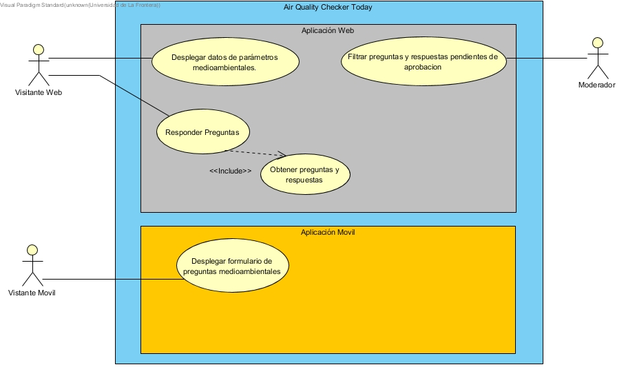

Comportamiento Dinámico
=====================

Especificación De Escenarios
~~~~~~~~~~~~~~~~~~~~~~~~~~~~

Para describir el comportamiento dinamico utilizaremos el diagrama de **casos de usos**.

Casos de Uso
------------

    
    
    
        
    
Definición de **Actores**.
--------------------------------   
+------------------------+----------------------------------------------------------+
|  ACT - <01>            | Visitante Web                                            |
+------------------------+----------------------------------------------------------+
|  Descripción           |  Corresponde al visistante web que accede a la           |
|                        |  información sobre paramestros medioambientales y        |
|                        |  responder preguntas en el sistema web.                  |
+------------------------+----------------------------------------------------------+

+------------------------+----------------------------------------------------------+
|  ACT - <02>            | Visitante Móvil                                          |
+------------------------+----------------------------------------------------------+
|  Descripción           | Corresponde al visitante movil que accede para realizar  |
|                        | preguntas.                                               |
+------------------------+----------------------------------------------------------+

+------------------------+----------------------------------------------------------+
|  ACT - <03>            | Visitante Moderador                                      |
+------------------------+----------------------------------------------------------+
|  Descripción           |  Corresponde al usuario que accede para filtrar las      |
|                        |  preguntas y las respuestas de los demas visitantes.     |
+------------------------+----------------------------------------------------------+

    
Definición de **casos de usos**.
--------------------------------

+------------------------+----------------------------------------------------------+
|  CU - <01>             |   Visualizar datos de parámetros medioambientales        |
+------------------------+----------------------------------------------------------+
|  Actores               |      ACT - <01>                                          |
+------------------------+----------------------------------------------------------+
|  Descripción           | Permite al actor visualizar los datos de parametros      |
|                        | medioambientales.                                        |
+------------------------+----------------------------------------------------------+
| Pre-condición          | El actor esta autentificado.                             |
+------------------------+-----+----------------------------------------------------+
| Secuencia Normal       |Paso | Acción                                             |
|                        +-----+----------------------------------------------------+
|                        |  1  | El usuario selecciona fechas para visualizar       |
|                        |     | mediciones.                                        |
|                        +-----+----------------------------------------------------+ 
|                        |  2  | El sistema extrae los datos registrados en la base |
|                        |     | de datos.                                          |
+                        +-----+----------------------------------------------------+
|                        |  3  | El sistema muestra los registros de parametros     |
|                        |     | medioambientales.                                  |
+------------------------+-----+----------------------------------------------------+

+------------------------+----------------------------------------------------------+
|  CU - <02>             |   Responder Preguntas                                    |
+------------------------+----------------------------------------------------------+
|  Actores               |     ACT - <01>                                           |
+------------------------+----------------------------------------------------------+
|  Descripción           | Permite al usuario responder pregunatas.                 |
+------------------------+----------------------------------------------------------+
| Pre-condición          | El campo de texto debe tener contenido.                  |
+------------------------+----------------------------------------------------------+
| Post-condición         | El actor recibió una alerta indicando que el mensaje se  |
|                        | envió.                                                   |
+------------------------+-----+----------------------------------------------------+
| Secuencia Normal       |Paso | Acción                                             |
|                        +-----+----------------------------------------------------+
|                        |  1  | Escoger la pregunta a responder                    |
|                        +-----+----------------------------------------------------+
|                        |  2  | Rellenar el campo con el contenido a enviar.       |
|                        +-----+----------------------------------------------------+
|                        |  3  | Presionar el botón "Enviar"                        |
+------------------------+-----+----------------------------------------------------+
|Puntos de Inclusión     |   Obtener preguntas y respuesas                          |
+------------------------+----------------------------------------------------------+

+------------------------+----------------------------------------------------------+
|  CU - <03>             |  Obtener preguntas y respuestas.                         |
+------------------------+----------------------------------------------------------+
|  Actores               |          ACT - <01>                                      |
+------------------------+----------------------------------------------------------+
|  Descripción           | El actor puede acceder a las diferentes preguntas y      |
|                        | respuestas que han sido aprobadas.                       |
+------------------------+-----+----------------------------------------------------+
| Secuencia Normal       |Paso | Acción                                             |
|                        +-----+----------------------------------------------------+
|                        |  1  | Dirigirse al menú de preguntas y respuestas.       |
+------------------------+-----+----------------------------------------------------+

+------------------------+----------------------------------------------------------+
|  CU - <03>             | Filtrar preguntas y respuestas pendientes de aprobación  |                                      
+------------------------+----------------------------------------------------------+
|  Actores               |     ACT - <03>                                           |
+------------------------+----------------------------------------------------------+
|  Descripción           | Permite al moderador aprobar y/o eliminar preguntas.     |
+------------------------+----------------------------------------------------------+
| Pre-condición          | Hay preguntas por aprobar.                               |
+------------------------+-----+----------------------------------------------------+
| Secuencia Normal       |Paso | Acción                                             |
|                        +-----+----------------------------------------------------+
|                        |  1  | Dirigirse al panel de preguntas no aprobadas.      |
|                        +-----+----------------------------------------------------+ 
|                        |  2  | Presionar el botón 'Rechazar' de la pregunta o     |
|                        |     | respuesta que se desea rechazar.                   |
|                        +-----+----------------------------------------------------+
|                        |  3  | El sistema realiza los cambios a las preguntas o   |
|                        |     | respuestas seleccionadas.                          |
+------------------------+-----+----------------------------------------------------+
| Secuencia Alternativa  |Paso | Acción                                             |
+------------------------+-----+----------------------------------------------------+
|                        |  2b | Presionar el botón 'Aceptar' de la pregunta o      |
|                        |     | respuesta que se desea aprobar.                    |
+------------------------+-----+----------------------------------------------------+

+------------------------+----------------------------------------------------------+
|  CU - <03>             |  Registrar preguntas                                     |
+------------------------+----------------------------------------------------------+
|  Actores               |          ACT - <02>                                      |
+------------------------+----------------------------------------------------------+
|  Descripción           | El actor puede registrar preguntas medioambientales.     |
+------------------------+-----+----------------------------------------------------+
| Secuencia Normal       |Paso | Acción                                             |
|                        +-----+----------------------------------------------------+
|                        |  1  | Dirigirse al menú de preguntas y respuestas.       |
+------------------------+-----+----------------------------------------------------+
| Secuencia Alternativa  |Paso | Acción                                             |
+------------------------+-----+----------------------------------------------------+
|                        |  1  | El actor ingresa la pregunta y la envía.           |
|                        +-----+----------------------------------------------------+
|                        |  2  | El sistema registra la pregunta y muestra un       |
|                        |     | mensaje indicando que la nueva pregunta se         |
|                        |     | encuentra en evaluación.                           |
+------------------------+-----+----------------------------------------------------+

+------------------------+----------------------------------------------------------+
|  CU - <03>             |  Mostrar preguntas.                                      |
+------------------------+----------------------------------------------------------+
|  Actores               |          ACT - <02>                                      |
+------------------------+----------------------------------------------------------+
|  Descripción           | El actor puede acceder a las diferentes preguntas que él |
|                        | registró, y puede ver las respuestas de las preguntas    |
|                        | aprobadas.                                               |
+------------------------+-----+----------------------------------------------------+
| Secuencia Normal       |Paso | Acción                                             |
|                        +-----+----------------------------------------------------+
|                        |  1  | Dirigirse al menú de preguntas y respuestas.       |
|                        +-----+----------------------------------------------------+
|                        |  2  | El usuario selecciona la pregunta deseada.         |
|                        +-----+----------------------------------------------------+
|                        |  3  | El sistema entrega todos los datos de la pregunta  |
|                        |     | seleccionada.                                      |
+------------------------+-----+----------------------------------------------------+

Modelo de Interacción de Componentes
~~~~~~~~~~~~~~~~~~~~~~~~~~~~~~~~~~~~

Mecanismos
----------
