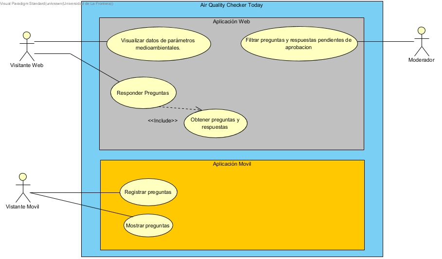

Comportamiento Dinámico
=====================

Escenarios
----------

====================== ============================
table test             asdf
====================== ============================
Especificación
~~~~~~~~~~~~~~

Modelo de Interacción de Componentes
~~~~~~~~~~~~~~~~~~~~~~~~~~~~~~~~~~~~

Mecanismos
----------
