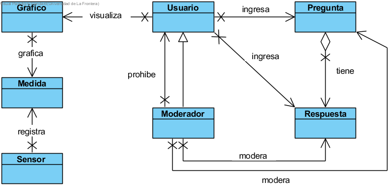

Marco Conceptual
=====

Dominio Léxico
--------------

- **Sensor**: Es un aparato electrónico que registra medidas medioambientales del sector en el que se encuentra.
- **Medida**: Consiste en un registro que graba información de temperatura y humedad en un momento específico de tiempo.
- **Gráfico**: Es un gráfico de interpolación que muestra variaciones de medidas entre un rango de tiempo.
- **Pregunta**: Es una pregunta sobre el clima, que puede ser creada por cualquier tipo de usuario.
- **Respuesta**: Es un registro que puede ser creado por cualquier tipo de usuario, para poder responder una pregunta.
- **Moderador**: Un tipo de usuario que puede gestionar las cuentas de usuario del sistema, y moderar/sancionar preguntas y respuestas indebidas.
- **Usuario**: Cualquier tipo de persona que utiliza el sistema y registra una cuenta de usuario en el.

Diagrama Léxico
---------------

