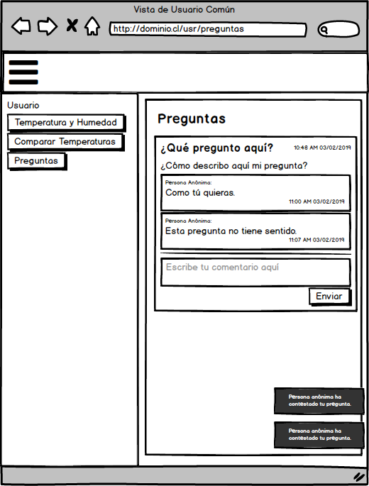

.. -*- coding: utf-8 -*-

Siguiendo la Metodología AD-HOC
=================================

.. image:: images/AD_HOC.jpg
    :scale: 30 %
    :align: center

Vision y Objetivo
------------------
La complejidad inherente de los actuales sistemas hace necesario diseñar una apropiada
arquitectura para los sistemas, de modo de enfrentar los diversos cambios requeridos, así
como satisfacer los requisitos funcionales como no funcionales.
En esta ocasión, se requiere diseñar un sistema que permita capturar parámetros
medioambientales (temperatura y humedad) y proveer una plataforma web que permita
visualizar en forma gráfica las temperaturas durante el dia. Se requiere además, que dicha
aplicación, pueda ser vista desde un equipo móvil (android), pero en este caso, se requiere
enviar preguntas específicas que deben ser almacenadas en el sitio web, para ser
respondidas y que sean visibles para todos los usuarios.

Se identifican los Stakeholders
-------------------------------
Para la realización del proyecto se ha identificado 3 tipos de usuarios.
Usuarios Web: Es aquel usuario que se conecta al sistema desde la web.
Usuario Móvil: Es aquel usuario que se conecta al sistema desde una App Móvil.
Usuario Moderador: Es aquel usuario que autoriza o niega las preguntas enviadas por un usuario.

Se definen los objetivos
-------------------------
De acuerdo a cada uno de los usuarios identificados los los objetivos que esperan cumplir cada uno de ellos.

**Usuario Web**

Objetivos:

Conocer datos de parámetros medioambientales.

Proveer de ayuda a las preguntas de usuarios móviles.

**Usuario Movil**

Objetivos:

Obtener información de temperatura de diferentes situaciones.

**Usuario Moderador**

Objetivos:

Autorización de la publicación de mensajes.

Historias de Usuario
-------------------

Luego de realizar conversaciones con los stackeholder se definen y se eligen las historias de usuarios para ser implementadas en el sistema.

Yo como <Usuario> quiero <hacer alguna acción> que me entregue <algo>.

**Usuario Web**

 - HU-WEB - 01 Visualizar la temperatura y humedad actuales.
 - HU-WEB - 02 Visualizar un mapa de temperaturas maximas y minimas dentro de un intervalo dado.
 - HU-WEB - 03 Visualizar en gráficos los valores históricos de temperatura y humedad para poder comparar dentro de un intervalo      
   específico de fechas.
 - HUW - 04 Permitir responder a las preguntas del usuario móvil.

**Usuario Móvil**

 - HU-MOV - 01 Yo como usuario móvil quiero poder enviar preguntas acerca del clima.
 - HU-MOV - 02 Yo como usuario móvil quiero saber cuando mis preguntas sean aprobadas para ser publicadas.
 - HU-MOV - 03 Yo como usuario móvil quiero ser notificado cuando mis preguntas sean respondidas.
 - HU-MOV - 04 Yo como usuario móvil quiero visualizar las respuestas a mis preguntas.

**Moderador**

 - HU-MOD - 01 Yo como usuario moderador quiero saber cuando alguien realiza una pregunta para poder aprobar o no (recibir una 
   notificación).
 - HU-MOD - 02 Yo como usuario moderador quiero aprobar preguntas de usuario móvil.
 - HU-MOD - 03 Yo como usuario moderador quiero saber cuando alguien responde a una de las preguntas ya aprobadas para filtrar 
   su contenido.

Selección de historias de usuario
---------------------------------
En primer lugar se definen los criterios para la selección de las historias de usuarios que se implementarán. Cada uno de los siguientes criterios se aplica asignando una nota entre 1-10.

 - **Complejidad de implementación:** Nota de 1 hasta 10, donde 1 es muy fácil de implementar, y 10 es muy difícil su implementación.
 - **Relevancia para el Usuario:** Nota de 1 hasta 10, donde 1 es de muy poca relevancia, y 10 es muy importante o crucial su implementación.
 - **Disponibilidad de herramientas para reuso:** Nota de 1 hasta 10, donde 1 significa que no existen herramientas o librerias para su reuso, y 10 significa que existen suficientes librerias y son de fácil implementación.

Usuario web
~~~~~~~~~~~
+------------------------+---------------------+---------------------------------+-------------------------------+
| **Historia de usuario**| **Complejidad de**  | **Relevancia para el Usuario:** | **Disponibilidad de**         |
|                        | **implementación:** |                                 | **herramientas para reuso:**  |
+------------------------+---------------------+---------------------------------+-------------------------------+
| HU-WEB - 01            |                     |                                 |                               |
+------------------------+---------------------+---------------------------------+-------------------------------+
| HU-WEB - 02            |                     |                                 |                               |
+------------------------+---------------------+---------------------------------+-------------------------------+
| HU-WEB - 03            |                     |                                 |                               |
+------------------------+---------------------+---------------------------------+-------------------------------+
| HU-WEB - 04            |                     |                                 |                               |
+------------------------+---------------------+---------------------------------+-------------------------------+

Usuario movil
~~~~~~~~~~~~~
+------------------------+---------------------+---------------------------------+-------------------------------+
| **Historia de usuario**| **Complejidad de**  | **Relevancia para el Usuario:** | **Disponibilidad de**         |
|                        | **implementación:** |                                 | **herramientas para reuso:**  |
+------------------------+---------------------+---------------------------------+-------------------------------+
| HU-MOV - 01            |                     |                                 |                               |
+------------------------+---------------------+---------------------------------+-------------------------------+
| HU-MOV - 02            |                     |                                 |                               |
+------------------------+---------------------+---------------------------------+-------------------------------+
| HU-MOV - 03            |                     |                                 |                               |
+------------------------+---------------------+---------------------------------+-------------------------------+
| HU-MOV - 04            |                     |                                 |                               |
+------------------------+---------------------+---------------------------------+-------------------------------+

Usuario moderador
~~~~~~~~~~~~~~~~~
+------------------------+---------------------+---------------------------------+-------------------------------+
| **Historia de usuario**| **Complejidad de**  | **Relevancia para el Usuario:** | **Disponibilidad de**         |
|                        | **implementación:** |                                 | **herramientas para reuso:**  |
+------------------------+---------------------+---------------------------------+-------------------------------+
| HU-MOD - 01            |                     |                                 |                               |
+------------------------+---------------------+---------------------------------+-------------------------------+
| HU-MOD - 02            |                     |                                 |                               |
+------------------------+---------------------+---------------------------------+-------------------------------+
| HU-MOD - 03            |                     |                                 |                               |
+------------------------+---------------------+---------------------------------+-------------------------------+

Mockups
-------

A continuacion se presentan los mockups diseñados de acuerdo a una posterior discucion con el equipo de desarrollo, de esta forma.

**Mockups peteneciente a Usuario Web**

    
      

    

    
  
    

**Mockups peteneciente a Usuario Móvil**

    
    

    
    

    

.. image:: images/estadopreguntamovils.PNG
    :scale: 60 %
    :align: center
    
    
    .. image:: images/listapreguntamovil.PNG
    :scale: 60 %
    :align: center

**Mockups peteneciente a Usuario Moderador**

    
    

