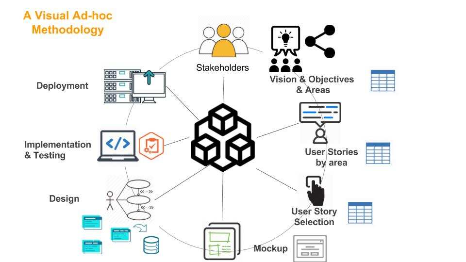

Planteamiento del Problema
=================================

Enunciado:
-----------

La complejidad inherente de los actuales sistemas hace necesario diseñar una apropiada
arquitectura para los sistemas, de modo de enfrentar los diversos cambios requeridos, así
como satisfacer los requisitos funcionales como no funcionales.
En esta ocasión, se requiere diseñar un sistema que permita capturar parámetros
medioambientales (temperatura y humedad) y proveer una plataforma web que permita
visualizar en forma gráfica las temperaturas durante el dia. Se requiere además, que dicha
aplicación, pueda ser vista desde un equipo móvil (android), pero en este caso, se requiere
enviar preguntas específicas que deben ser almacenadas en el sitio web, para ser
respondidas y que sean visibles para todos los usuarios.

AD-HOC Methodology:
-------------------

¿Qué es la Metodología AD-HOC?
---------------

.. note:: 
    El código se almacena de forma pública, aunque también se puede hacer de forma privada, creando una cuenta de pago.

